# Visual Usage Guide & Annotated System Walkthrough

> **Automated House Valuation & Estimation Management System**  
> *Water Resources Department, Government of Maharashtra (Jigaon Major Irrigation Project)*

---

## 📑 Table of Contents

1. [01. Institutional Login Portal](#01-institutional-login-portal)
2. [02. Executive Dashboard & Analytics](#02-executive-dashboard--analytics)
3. [03. Projects Scheme Registry](#03-projects-scheme-registry)
4. [04. Step 2: Property Particulars](#04-step-2-property-particulars)
5. [05. Step 3: Structure Specifications & Lifecycle](#05-step-3-structure-specifications--lifecycle)
6. [06. Step 4: Detailed Measurements & Opening Deductions](#06-step-4-detailed-measurements--opening-deductions)
7. [07. Step 4: Mathematical Formula Explainability Modal](#07-step-4-mathematical-formula-explainability-modal)
8. [08. Step 5: Abstract Estimate & PWD CSR Rate Linking](#08-step-5-abstract-estimate--pwd-csr-rate-linking)
9. [09. Step 6: 7% Compound Interest Y.P. Depreciation Engine](#09-step-6-7-compound-interest-yp-depreciation-engine)
10. [10. Step 7: Second Valuation (Salvage Material Abstract)](#10-step-7-second-valuation-salvage-material-abstract)
11. [11. Step 8: Final Valuation & Master Recapitulation](#11-step-8-final-valuation--master-recapitulation)
12. [12. Step 9: Panchanama, Witness Endorsements & Evidence](#12-step-9-panchanama-witness-endorsements--evidence)
13. [13. Step 10: Official Editable & Shareable Government Report](#13-step-10-official-editable--shareable-government-report)
14. [14. PWD Common Schedule of Rates (CSR) Database](#14-pwd-common-schedule-of-rates-csr-database)
15. [15. Government 7% Compound Interest Year's Purchase (Y.P.) Table](#15-government-7-compound-interest-years-purchase-yp-table)
16. [16. System Audit Trail & Immutable Action Logs](#16-system-audit-trail--immutable-action-logs)

---

## 01. Institutional Login Portal
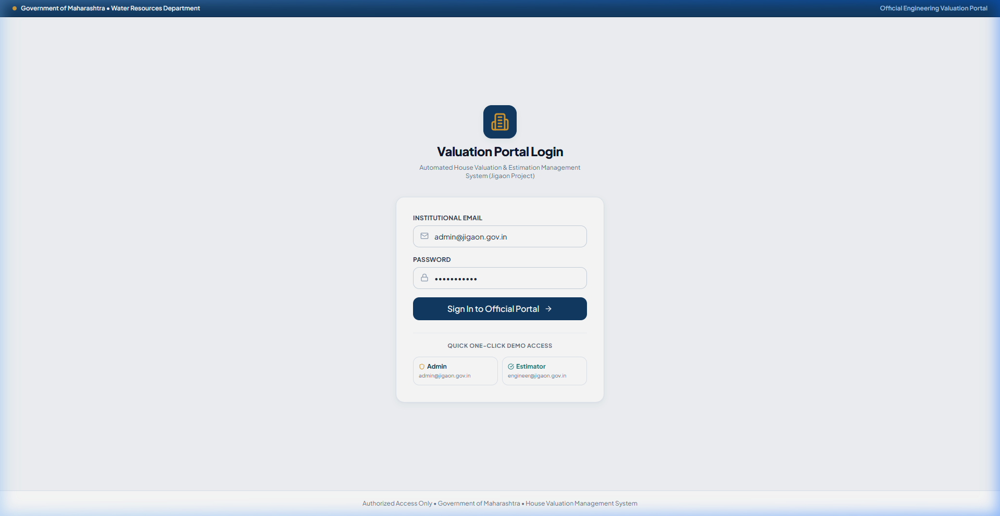

### 📌 Purpose & Capabilities
* Secure institutional gateway with role-based access control (`ADMIN`, `ESTIMATOR`, `CHECKER`, `VIEWER`).
* Built-in 1-click authentication shortcuts for rapid field evaluation and demonstration.
* Compliant with state government identity protocols.

---

## 02. Executive Dashboard & Analytics
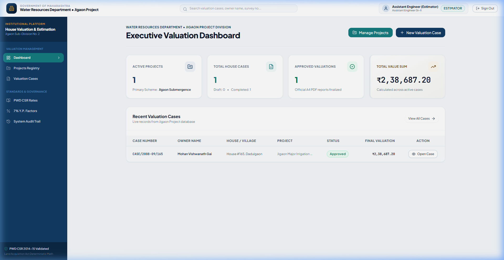

### 📌 Purpose & Capabilities
* Real-time executive KPI metrics: Active Projects, Sanctioned Valuation Cases, Total Valuation Disbursal Sum (₹ 2,38,687.20).
* Recent Case Registry overview with instant navigation into multi-step estimation workflows.
* Quick-action shortcuts to initialize cases, search CSR items, and inspect Y.P. factor tables.

---

## 03. Projects Scheme Registry
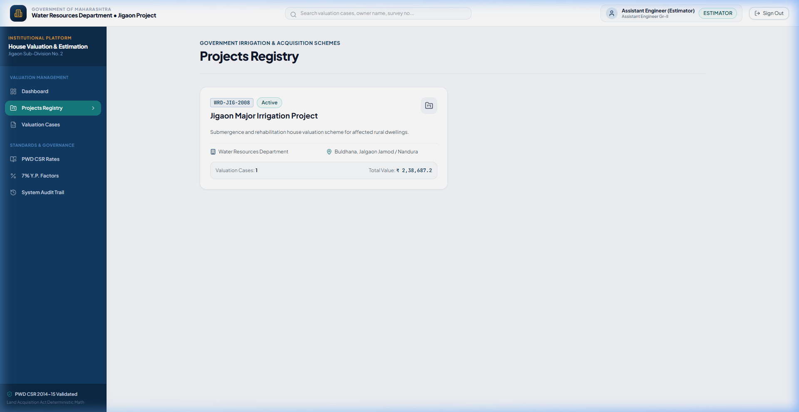

### 📌 Purpose & Capabilities
* Hierarchical mapping of irrigation projects (e.g. *Jigaon Major Irrigation Project*), administrative divisions, and sub-divisions.
* Tracks affected villages (*Dadulgaon*, *Nandura*), talukas, and cumulative valuation estimates per scheme.

---

## 04. Step 2: Property Particulars
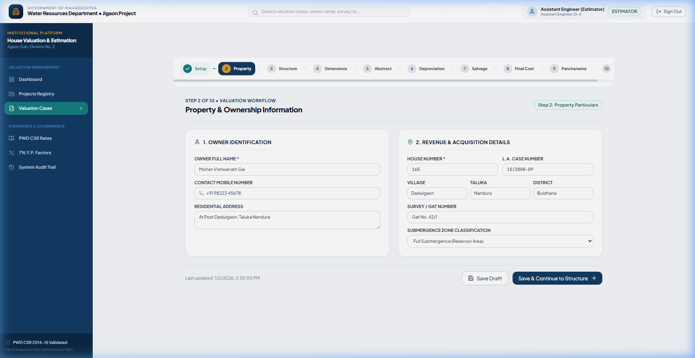

### 📌 Purpose & Capabilities
* Records land acquisition case metadata (`CASE/2008-09/165`), owner credentials (*Shri Mohan Vishwanath Gai*), Gat/Survey No. (`42/1`), and House No. (`165`).
* Identifies submergence category (*Full Submergence / Reservoir Basin*).

---

## 05. Step 3: Structure Specifications & Lifecycle
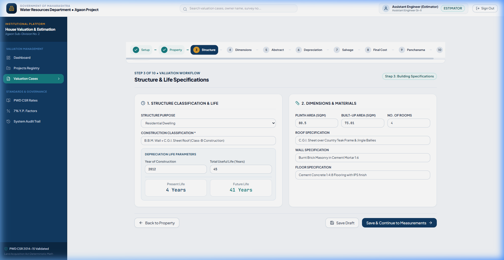

### 📌 Purpose & Capabilities
* Classifies structural construction type (*Class-B: BBM Walls in CM 1:6 + Teak Wood Roof Trusses + 0.63mm CGI Sheet Roof*).
* Automates lifecycle analysis: Present age $d = 4\text{ years}$ (Built 2012, Valued 2016), Total life $D = 45\text{ years}$, Balance future life $r = 41\text{ years}$.

---

## 06. Step 4: Detailed Measurements & Opening Deductions
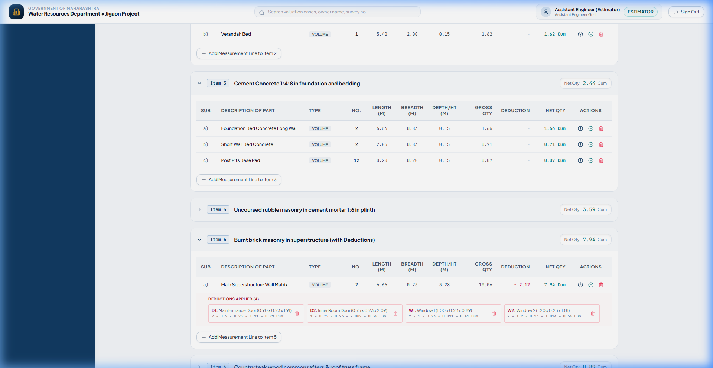

### 📌 Purpose & Capabilities
* 18 itemized work groups supporting multi-line dimensional evaluation ($L \times B \times D$).
* Integrated Opening Deductions Matrix for doors ($D_1, D_2$) and windows ($W_1, W_2, W_3$).
* Real-time calculation: Item 5 Superstructure evaluates $10.06\text{ Cum (Gross)} - 2.12\text{ Cum (Deductions)} = \mathbf{7.94\text{ Cum (Net)}}$.

---

## 07. Step 4: Mathematical Formula Explainability Modal
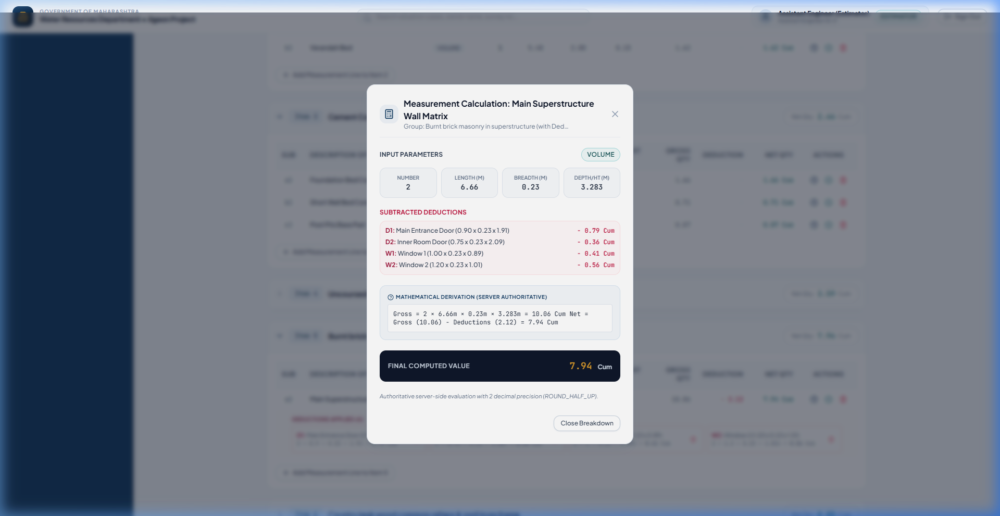

### 📌 Purpose & Capabilities
* Full transparent derivation popup for engineering scrutiny.
* Breaks down input dimensions, individual opening subtractions, and server-side arithmetic rules (`ROUND_HALF_UP`).

---

## 08. Step 5: Abstract Estimate & PWD CSR Rate Linking
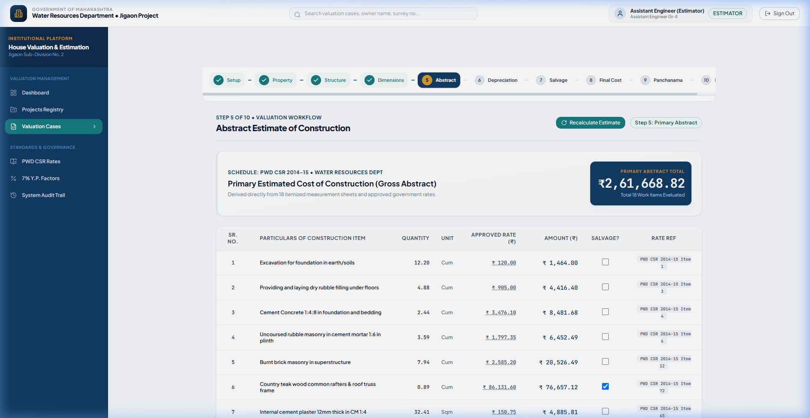

### 📌 Purpose & Capabilities
* Synchronizes quantities directly from measurement sheets and pairs them with official PWD CSR 2014-15 rates.
* Computes itemized amounts and presents a sticky grand total: **₹ 2,61,669.00**.

---

## 09. Step 6: 7% Compound Interest Y.P. Depreciation Engine
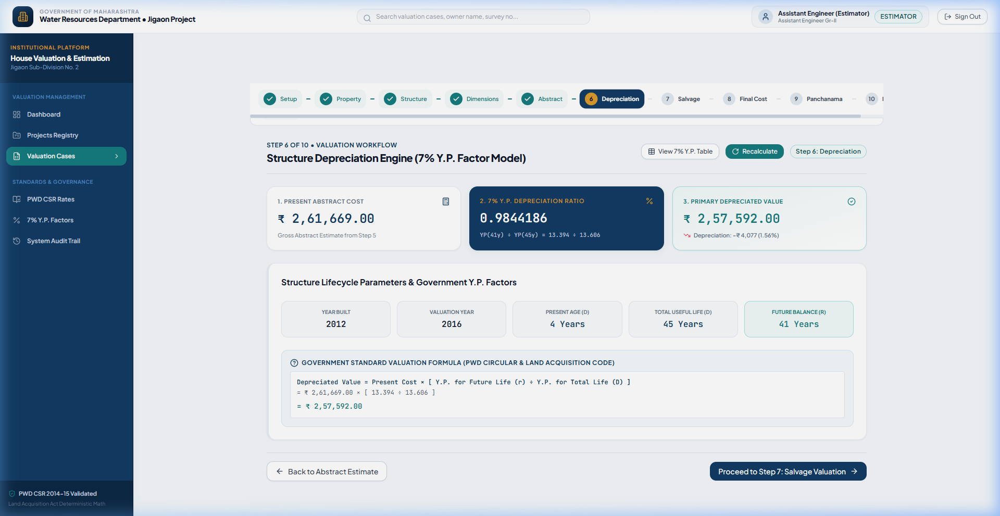

### 📌 Purpose & Capabilities
* Implements Government compound interest depreciation circular:
  $$\text{Depreciated Structure Value} = ₹ 2,61,669.00 \times \frac{13.394 (YP_{41})}{13.606 (YP_{45})} = \mathbf{₹ 2,57,592.00}$$
* Displays depreciation loss (₹ 4,077.00 / 1.56%) with clean interactive ratio cards.

---

## 10. Step 7: Second Valuation (Salvage Material Abstract)
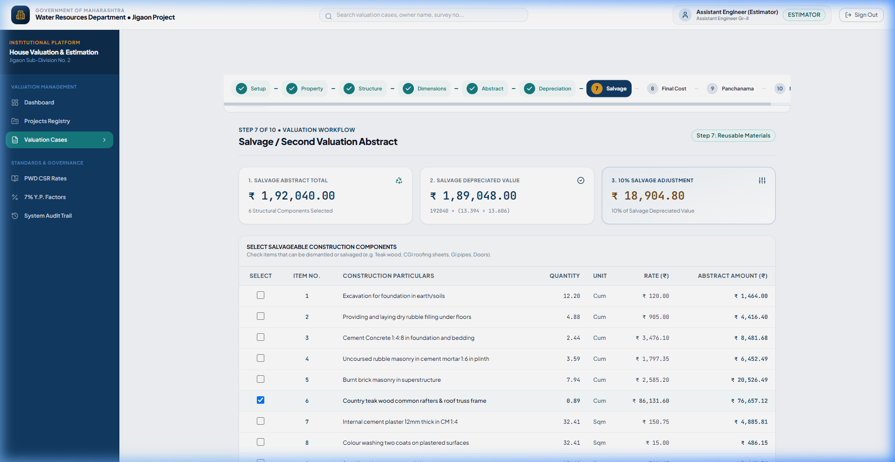

### 📌 Purpose & Capabilities
* Selects reusable structural components (Country Teak wood, CGI roofing sheets, G.I. pipes, Iron grills, Chaukhat frames).
* Evaluates Salvage Abstract Total (**₹ 1,92,040.00**) and Salvage Depreciated Value (**₹ 189,048.00**).

---

## 11. Step 8: Final Valuation & Master Recapitulation
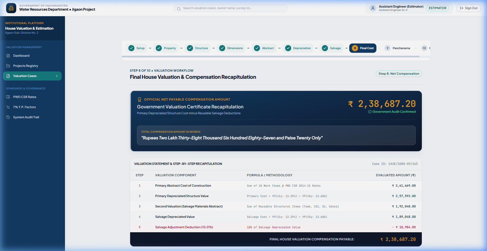

### 📌 Purpose & Capabilities
* Master Recapitulation Sheet:
  * Primary Depreciated Value: **₹ 2,57,592.00**
  * Less: 10% Salvage Adjustment ($10\% \times ₹ 189,048.00$): **- ₹ 18,904.80**
  * **Net Payable Compensation Valuation**: $\mathbf{₹ 2,38,687.20}$
* Dynamic salvage percentage slider ($0\%$ to $25\%$).
* Generates official Indian currency text: *"Rupees Two Lakh Thirty-Eight Thousand Six Hundred Eighty-Seven and Paise Twenty Only"*.
* 3-Tier sign-off verification hierarchy (Sectional Engineer $\to$ Assistant Engineer $\to$ Executive Engineer).

---

## 12. Step 9: Panchanama, Witness Endorsements & Evidence
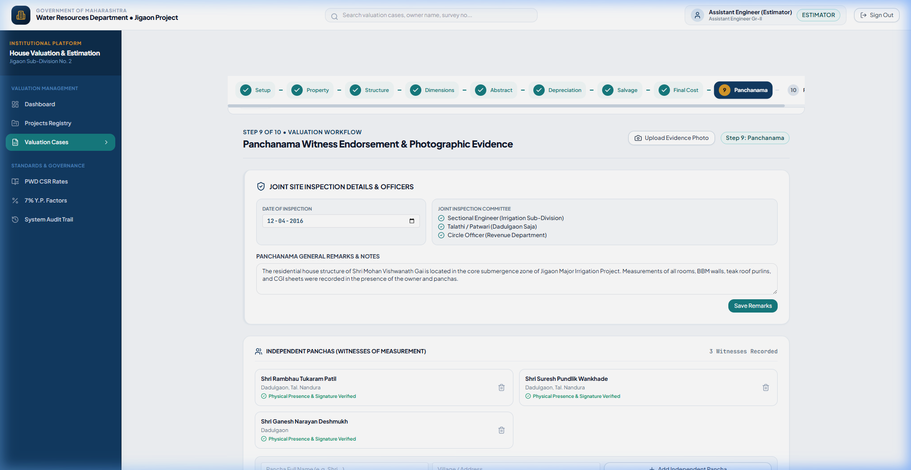

### 📌 Purpose & Capabilities
* Records Joint Inspection Committee officers and independent local witnesses (Panchas).
* Categorized structural photographic evidence gallery.

---

## 13. Step 10: Official Editable & Shareable Government Report
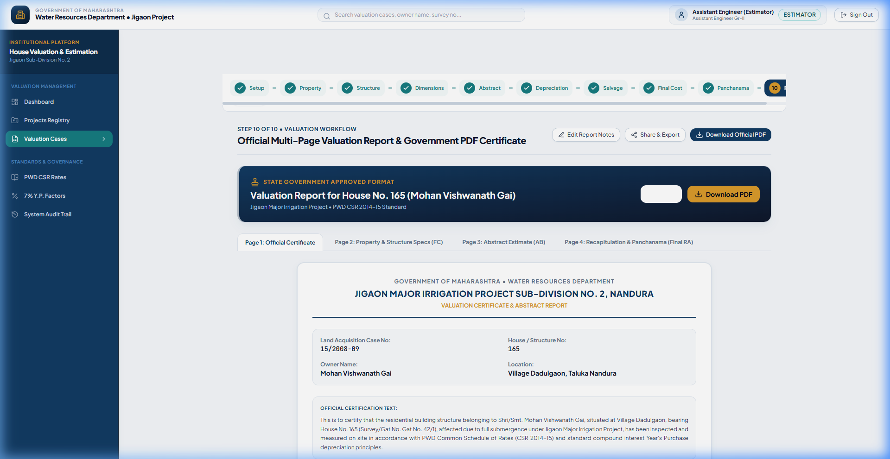

### 📌 Purpose & Capabilities
* **In-Place Live Report Editing**: Modify certificate title, remarks, and signatory designations directly in the preview.
* **Share & Export Engine**: 1-click copyable verification URL and JSON/CSV summary export.
* **Institutional PDF Generation**: Streams official 7-page multi-sheet vector PDF certificate.

---

## 14. PWD Common Schedule of Rates (CSR) Database
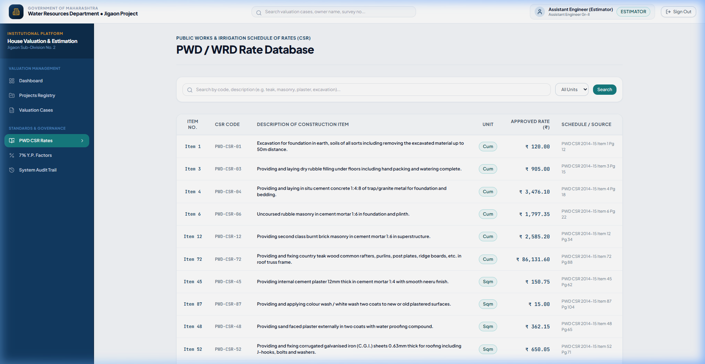

### 📌 Purpose & Capabilities
* Catalog of 2014-15 PWD Civil & Structural items with keyword search, CSR codes, and unit filtering.

---

## 15. Government 7% Compound Interest Year's Purchase (Y.P.) Table
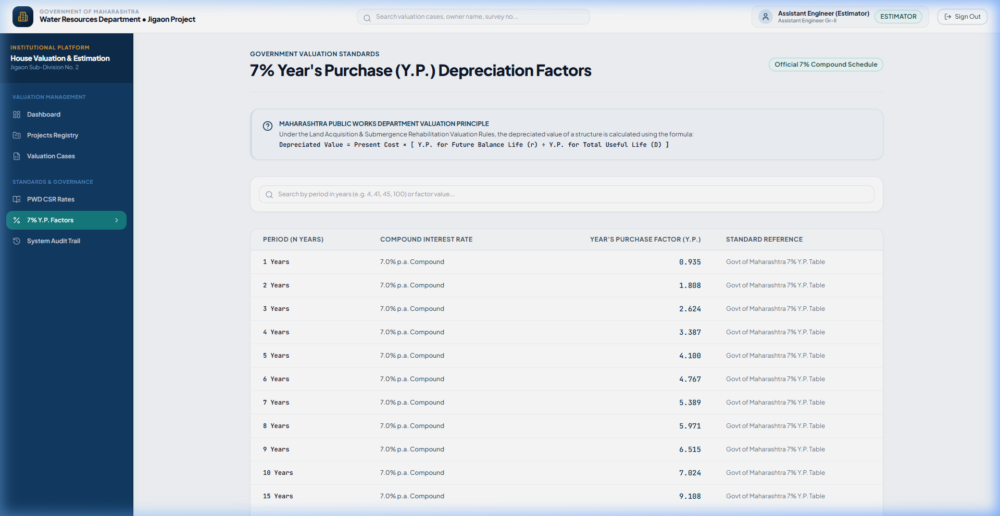

### 📌 Purpose & Capabilities
* Authoritative 100-year Year's Purchase factor table for compounding depreciation calculations.

---

## 16. System Audit Trail & Immutable Action Logs
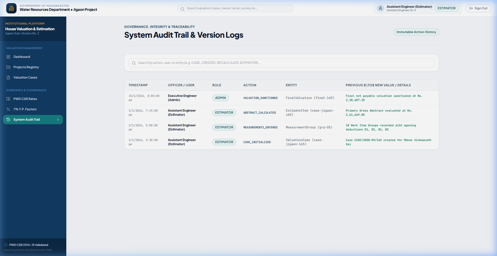

### 📌 Purpose & Capabilities
* Immutable chronological audit trail recording every case creation, measurement alteration, recalculation, and sanctioning event with user ID, role, and exact timestamp.
